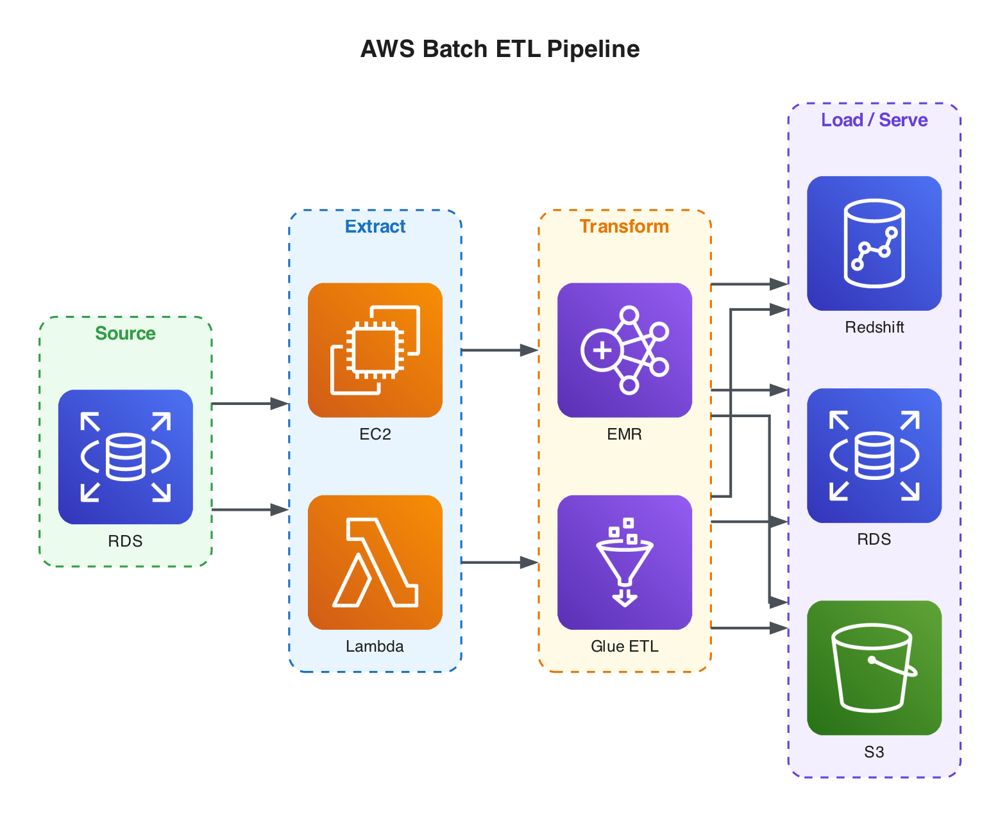
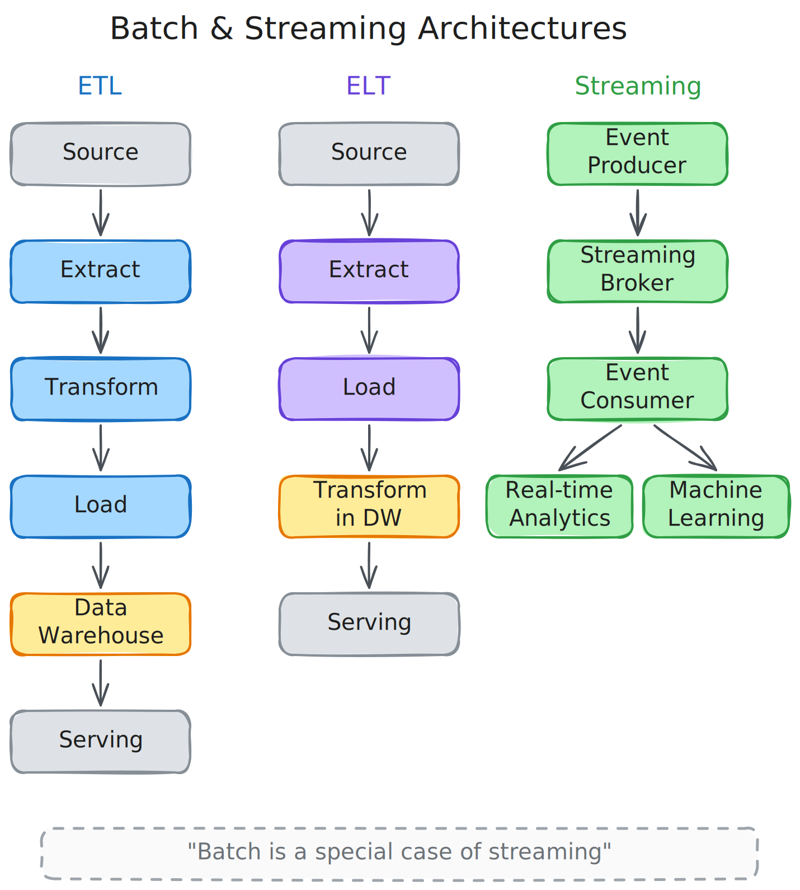

<div align="center">

# Data Engineering Specialization Website

**Comprehensive course notes with 200+ auto-generated diagrams, interactive glossary, and full-text search.**

[](https://astro.build)
[](https://www.typescriptlang.org)
[](https://tailwindcss.com)
[](https://python.org)
[](https://github.com/guyardon/data-engineering-specialization-website/actions)

[**View Live Site →**](https://guyardon.github.io/data-engineering-specialization-website)

</div>

---

## Highlights

**Dark & Light Themes** — Dark-first design with full theme switching. Every diagram, code block, and UI element adapts automatically.

**200+ Diagrams** — Programmatically generated from Python scripts. AWS architecture diagrams with real service icons and Excalidraw hand-drawn conceptual diagrams, each with dark and light variants.

**Interactive Glossary** — Categorized terms with drill-down detail views, pagination, diagram lightbox, and cross-references to course notes.

**Full-Text Search** — Pagefind-powered static search indexed at build time. Instant results with keyboard navigation.

**Content from Notion** — Course notes authored in Notion, synced to markdown, validated with Zod schemas, and rendered as static HTML.

---

## Diagram Showcase

<table>
<tr>
<td width="50%">

**AWS Architecture** — Real service icons via Python `diagrams` library



</td>
<td width="50%">

**Excalidraw Conceptual** — Hand-drawn style generated from Python scripts



</td>
</tr>
</table>

---

## Architecture

**Dual-language monorepo** — TypeScript/Astro for the website, Python for diagram generation. Separate dependency management with `package.json` and `pyproject.toml`.

```
                    ┌─────────────────────────────────────────┐
                    │              Content Pipeline            │
                    │                                         │
  Notion ──────► fetch-notion.mjs ──────► Markdown files     │
                    │                        │                │
                    │                   Astro Build           │
                    │                        │                │
                    │                   Pagefind Index        │
                    │                        │                │
                    │                    dist/ ──────► GitHub Pages
                    └─────────────────────────────────────────┘

                    ┌─────────────────────────────────────────┐
                    │             Diagram Pipeline             │
                    │                                         │
  Python scripts ──► .excalidraw JSON ──► SVG (light + dark) │
  Python scripts ──► diagrams lib ──────► PNG (light + dark) │
                    │                        │                │
                    │              public/images/diagrams/     │
                    └─────────────────────────────────────────┘
```

---

## Quick Start

**Prerequisites:** Node.js >= 22.12 · Python >= 3.13 · [uv](https://docs.astral.sh/uv/) · Graphviz

```bash
# 1. Install dependencies
npm install
uv sync --dev

# 2. Set up pre-commit hooks
uv run pre-commit install

# 3. Start development server
npm run dev
```

Open [localhost:4321](http://localhost:4321) to view the site.

---

## Commands

| Command                             | Action                               |
| :---------------------------------- | :----------------------------------- |
| `npm run dev`                       | Start dev server at `localhost:4321` |
| `npm run build`                     | Build site + search index to `dist/` |
| `npm run preview`                   | Preview production build locally     |
| `npm run lint`                      | Run ESLint                           |
| `npm run format`                    | Format with Prettier                 |
| `npm test`                          | Run Vitest in watch mode             |
| `npm run test:run`                  | Run Vitest once                      |
| `uv run pytest`                     | Run Python tests                     |
| `uv run pre-commit run --all-files` | Run all 7 pre-commit hooks           |

---

<details>
<summary><strong>Project Structure</strong></summary>

```
├── .github/workflows/deploy.yml    # CI/CD pipeline
├── .pre-commit-config.yaml         # 7 pre-commit hooks
├── astro.config.mjs                # Astro config
├── diagrams/
│   ├── artifacts/                  # .excalidraw source files (88)
│   ├── diagramlib/                 # Shared Python diagram library
│   │   ├── aws_diagram.py          #   AWS diagram helpers
│   │   ├── colors.py               #   Color palette constants
│   │   └── excalidraw.py           #   ExcalidrawDiagram builder class
│   └── scripts/                    # Generation scripts (76)
│       ├── generate-*.py           #   Excalidraw diagrams
│       └── generate-*-aws.py       #   AWS architecture diagrams
├── public/
│   └── images/
│       ├── diagrams/               # Generated SVGs + PNGs (214)
│       └── logos/                  # Technology logos (102)
├── scripts/
│   └── fetch-notion.mjs            # Notion API content sync
├── src/
│   ├── components/                 # Astro components (8)
│   ├── content/notes/              # Markdown content (from Notion)
│   ├── content.config.ts           # Content collection schema (Zod)
│   ├── data/glossary.json          # Glossary terms database
│   ├── layouts/NoteLayout.astro    # Shared note layout
│   ├── lib/                        # TS utilities + co-located tests
│   ├── pages/                      # index, glossary, notes/[...slug]
│   └── styles/global.css           # Global styles + theme variables
├── tests/                          # Python tests for diagramlib
├── package.json
├── pyproject.toml
└── uv.lock
```

</details>

<details>
<summary><strong>Code Quality</strong></summary>

Pre-commit hooks run automatically on every commit:

| Hook        | Tool     | Scope                                  |
| :---------- | :------- | :------------------------------------- |
| ruff-check  | Ruff     | Python lint + autofix                  |
| ruff-format | Ruff     | Python formatting                      |
| mypy        | mypy     | Type checking (`diagrams/diagramlib/`) |
| eslint      | ESLint   | `.js`, `.ts`, `.astro`                 |
| prettier    | Prettier | `.js`, `.ts`, `.astro`, `.css`, `.md`  |
| pytest      | pytest   | Python test suite                      |
| vitest      | Vitest   | TypeScript test suite                  |

</details>

<details>
<summary><strong>Generating Diagrams</strong></summary>

**Excalidraw diagram:**

```bash
uv run python diagrams/scripts/generate-batch-streaming.py
excalidraw-brute-export-cli diagrams/artifacts/batch-streaming.excalidraw \
  -o public/images/diagrams --dark-mode 0 --dark-mode 1
```

**AWS architecture diagram:**

```bash
uv run python diagrams/scripts/generate-batch-pipeline-aws.py
```

Excalidraw scripts produce `.excalidraw` JSON in `diagrams/artifacts/`, then `excalidraw-brute-export-cli` exports light + dark SVGs. AWS scripts produce PNGs directly into `public/images/diagrams/`.

</details>

---

## Deployment

Automated via GitHub Actions on every push to `main`:

**Checkout** → **Install** → **Fetch Notion content** → **Astro build** → **Pagefind index** → **Deploy to GitHub Pages**
